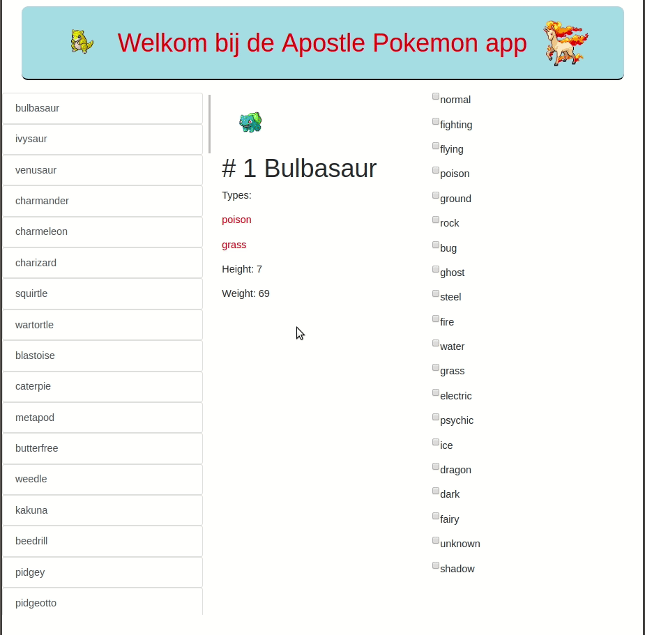

# vue-test-project

Test project to learn the vue.js framework. In this app I use axios to make http calls to the free pokeAPI. 
This project was created in just a few hours in which i learned the Vue.js framework.



## Project setup
```
npm install
```

### Compiles and hot-reloads for development
```
npm run serve
```
